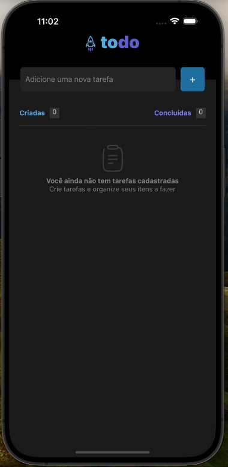

# todo-mobile

### Technologies used in the project:

- React-Native
- Expo
- React-native-async-storage/async-storage
- Typescript

### Command to run the project:

```jsx
npm run start ou yarn start ou npx expor start

```

### Gif

<div style="margin-top: 30px; margin-bottom: 30px; width: 100%; display: flex; flex-direction: column; align-items: center; border: 2px solid #e0e0e0; box-shadow: 0px 4px 6px rgba(0, 0, 0, 0.1);">
  <p style="margin-bottom: 10px;">Project Demonstration</p>
  
</div>

### Description

This is a simple project, developed to solidify my knowledge in React Native.

The core objective of the project is to manage a to-do list.

Within this scope, it is possible to add, remove, view the total number of tasks, and check the total number of completed tasks.

Despite being a project with a reduced scope, I chose to adopt the Domain-Driven Design (DDD) pattern to further enhance my expertise in this area.

All business rules are located in the domain folder.

Templates can be found in the screen folder.

I followed the recommended practice of separating responsibility layers, which will facilitate any future maintenance or expansion of the project.

I prioritized keeping the project as native as possible, avoiding the installation of multiple external libraries.

Additionally, I chose to save the information locally. However, thanks to DDD, this behavior can be easily changed: just replace the adapter in the repository folder.

A simple project to solidify knowledge in React-native.

The initial idea of the project is to have a to-do list, where one can add, remove, view the total number of tasks, and check the total number of completed tasks.

I chose to work with the DDD pattern, even though the project is simple, with the intention of improving my knowledge.

All the business rules are in the 'domain' folder.

The template is in the 'screen' folder.

Keeping up with the best practice of separating the layers makes it easier for any future maintenance or addition to the project.

I kept the project as native as possible, avoiding the installation of many libraries.

Also, I chose to save the information locally. This can be easily changed thanks to DDD, just change the adapter in the 'repository' folder.

### Run the project with IOS:

Download the Expo Go app, then read the QR-Code below:

<div style="display: flex; justify-content: align-items: center;">

</div>

### Run the project with Android:

Download the Expo Go app, then read the QR-Code below:

<div style="display: flex; justify-content: align-items: center;">

</div>
